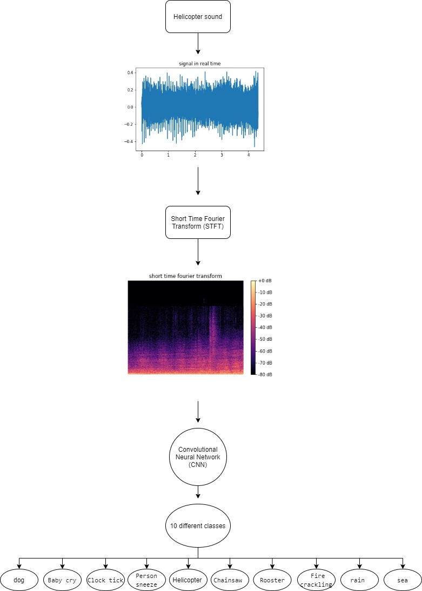

# Sound-Classification-Short-Time-Fourier-Transform-STFT



## Definition

This project classifies sound signals from different environmental classes in the ESC-10 dataset. the above photo summarizes the model steps: <br/>
1. The model read all the signals of different classes and assign a label number to each class.
2. The  signal is converted from the time domain to Short Time Fourier Transform (STFT).
3. Full Convolutional Neural Network(CNN) is defined and used to classify 10 different classes of ESC-10 dataset.
## Dependencies 
### To run this project you will need to:
1. download the ESC-10 dataset from this link: [ESC-10](https://dataverse.harvard.edu/dataset.xhtml?persistentId=doi:10.7910/DVN/YDEPUT)

2. change the directory name that contains the dataset to the name in the notebook file or change the name in the notebook file in these three lines:<br/>
```html
#here my directory name is "dataset"

data, samplerate = librosa.load("dataset/dog/1-30344-A.wav", sr=44000) 

for filepath in glob.iglob('dataset/*'):

for j in glob.iglob('dataset/'+i+'/*'):

```
### install this libraries:
- numpy
- keras
- matplotlib
- librosa
- pylab
- glob
- tensorflow
